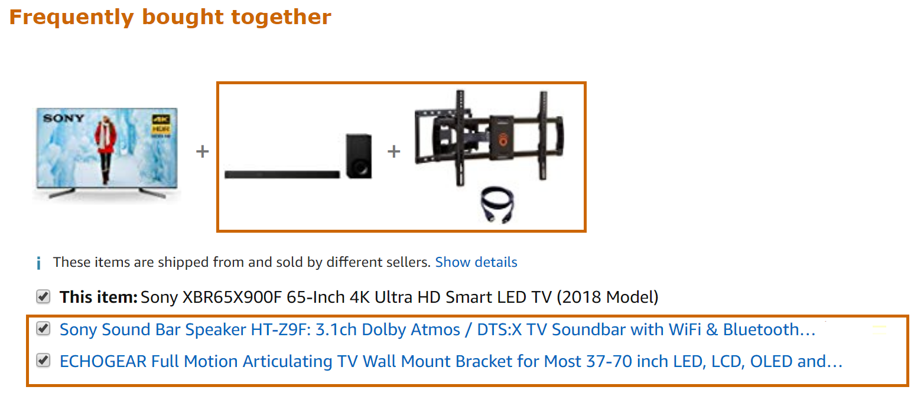

# Product Recommendation - Matrix Factorization problem sample

In this sample, you can see how to use [ML.Net for Delphi](https://crystalnet-tech.com/Products/mldotNet4Delphi/Default) to build a product recommendation scenario.

The style of recommendation in this sample is based upon the co-purchase scenario or products frequently
bought together which means it will recommend customers a set of products based upon their purchase order
history.



In this example, the highlighted products are being recommended based upon a frequently bought together learning model.


## Problem
For this tutorial we will use the Amazon product co-purchasing network dataset.

In terms of an approach for building our product recommender we will use One-Class Factorization Machines which uses a collaborative filtering approach.


The difference between one-class and other Factorization Machines approach we covered is that in this dataset we only have information on purchase order history.

We do not have ratings or other details like product description etc. available to us.

Matrix Factorization relies on ‘Collaborative filtering’ which operates under the underlying assumption that if a person A has the same opinion as a person B on an issue, A is more likely to have B’s opinion on a different issue than that of a randomly chosen person.

## DataSet
The original data comes from SNAP:
https://snap.stanford.edu/data/amazon0302.html

DataSet's Citation information can be found [here](./Data/DATASETS-CITATION.txt)

## Algorithm - [Matrix Factorization (Recommendation)](https://docs.microsoft.com/en-us/dotnet/machine-learning/resources/tasks#recommendation)

The algorithm for this recommendation task is Matrix Factorization, which is a supervised machine learning algorithm performing collaborative filtering.

## Solution

To solve this problem, you build and train an ML model on existing training data, evaluate how good it is (analyzing the obtained metrics), and lastly you can consume/test the model to predict the demand given input data variables.


### 1. Build model

Building a model includes:

* Download and copy the dataset Amazon0302.txt file from https://snap.stanford.edu/data/amazon0302.html.

* Replace the column names with only these instead:  ProductID	ProductID_Copurchased

* Given in the reader we already provide a KeyRange and product ID's are already encoded all we need to do is
  call the MatrixFactorizationTrainer with a few extra parameters.

Here's the code which will be used to build the model:
```Delphi

    //STEP 1: Create MLContext to be shared across the model creation workflow objects
    var mlContext: IMLContextManager := TMLContextManager.Create;

    //STEP 2: Read the trained data using TextLoader by defining the schema for reading the product co-purchase dataset
    //        Do remember to replace amazon0302.txt with dataset from https://snap.stanford.edu/data/amazon0302.html
    var traindata := mlContext.Data.LoadFromTextFile(TrainingDataLocation,
                    [
                       TMLTextLoaderColumn.Create('Label', TMLDataKind.dkSingle, 0),
                       TMLTextLoaderColumn.Create('ProductID', TMLDataKind.dkUInt32, [TMLTextLoaderRange.Create(1)], TMLKeyCount.Create(262111)),
                       TMLTextLoaderColumn.Create('CoPurchaseProductID', TMLDataKind.dkUInt32, [TMLTextLoaderRange.Create(1)], TMLKeyCount.Create(262111))
                    ], #9, True);

    //STEP 3: Your data is already encoded so all you need to do is specify options for MatrxiFactorizationTrainer with a few extra hyperparameters
            //        LossFunction, Alpa, Lambda and a few others like K and C as shown below and call the trainer.
            var options: IMLMatrixFactorizationTrainerOptions := TMLMatrixFactorizationTrainerOptions.Create();
            options.MatrixColumnIndexColumnName := 'ProductID';
            options.MatrixRowIndexColumnName := 'CoPurchaseProductID';
            options.LabelColumnName := 'Label';
            options.LossFunction := TMLLossFunctionType.lftSquareLossOneClass;
            options.Alpha := 0.01;
            options.Lambda := 0.025;
            // For better results use the following parameters
            //options.K = 100;
            //options.C = 0.00001;

//Step 4: Call the MatrixFactorization trainer by passing options.
            var est := mlContext.Recommendation().Trainers.MatrixFactorization(options);
```

### 2. Train Model

Once the estimator has been defined, you can train the estimator on the training data available to us.

This will return a trained model.

```Delphi

    //STEP 5: Train the model fitting to the DataSet
    //Please add Amazon0302.txt dataset from https://snap.stanford.edu/data/amazon0302.html to Data folder if FileNotFoundException is thrown.
    var model := est.Fit(traindata);
```

### 3. Consume Model

We will perform predictions for this model by creating a prediction engine/function as shown below.

The prediction engine creation takes in as input the following two classes.

```Delphi
    TCopurchase_prediction = class(TMLEntity)
    public
      Score: Single;
    end;

    TProductEntry = class(TMLEntity)
    public
      [KeyType(262111)]
      ProductID: Cardinal;

      [KeyType(262111)]
      CoPurchaseProductID: Cardinal;
    end
```

Once the prediction engine has been created you can predict scores of two products being co-purchased.

```Delphi
    //STEP 6: Create prediction engine and predict the score for Product 63 being co-purchased with Product 3.
    //        The higher the score the higher the probability for this particular productID being co-purchased
    var predictionengine := mlContext.Model.CreatePredictionEngine<TProductEntry, TCopurchase_prediction>(model);

    var ProductEntry := TProductEntry.Create;
    ProductEntry.ProductID := 3;
    ProductEntry.CoPurchaseProductID := 63;
    var prediction := predictionengine.Predict(ProductEntry);
```

#### Score in Matrix Factorization

The score produced by matrix factorization represents the likelihood of being a positive case. The larger the score value, the higher probability of being a positive case. However, the score doesn't carry any probability information. When making a prediction, you will have to compute multiple merchandises' scores and pick up the merchandise with the highest score.
