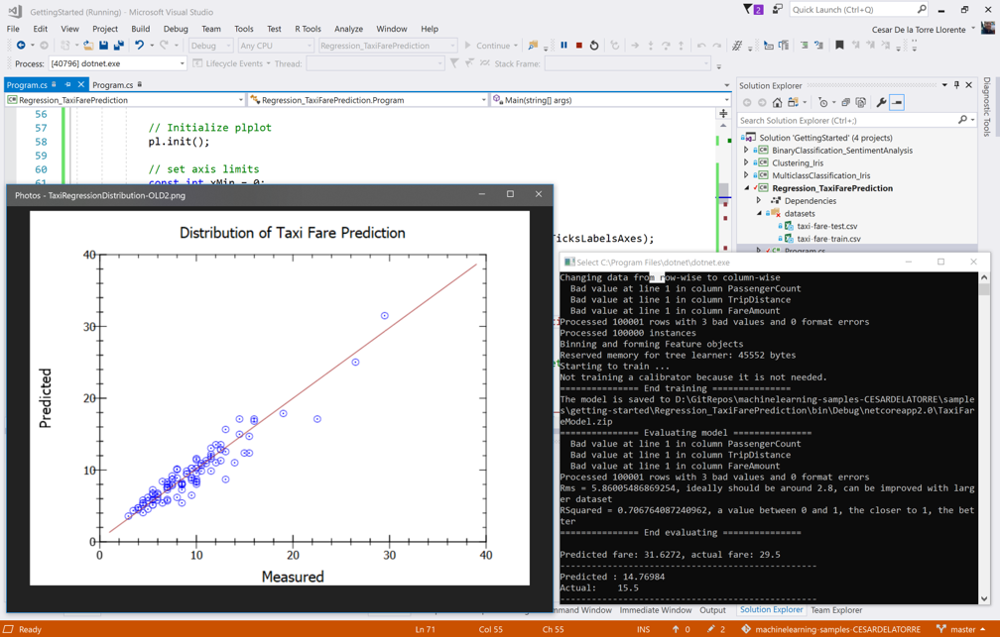

# Taxi Fare Prediction

In this introductory sample, you'll see how to use [ML.Net for Delphi](https://crystalnet-tech.com/Products/mldotNet4Delphi/Default) to predict taxi fares. In the world of machine learning, this type of prediction is known as **regression**.

## Problem
This problem is centered around predicting the fare of a taxi trip in New York City. At first glance, it may seem to depend simply on the distance traveled. However, taxi vendors in New York charge varying amounts for other factors such as additional passengers, paying with a credit card instead of cash and so on. This prediction can be used in application for taxi providers to give users and drivers an estimate on ride fares.

To solve this problem, we will build an ML model that takes as inputs: 
* vendor ID
* rate code
* passenger count
* trip time
* trip distance
* payment type

and predicts the fare of the ride.

## ML task - Regression
The generalized problem of **regression** is to predict some continuous value for given parameters, for example:
* predict a house price based on number of rooms, location, year built, etc.
* predict a car fuel consumption based on fuel type and car parameters.
* predict a time estimate for fixing an issue based on issue attributes.

The common feature for all those examples is that the parameter we want to predict can take any numeric value in certain range. In other words, this value is represented by `integer` or `float`/`double`, not by `enum` or `boolean` types.

## Solution
To solve this problem, first we will build an ML model. Then we will train the model on existing data, evaluate how good it is, and lastly we'll consume the model to predict taxi fares.


### 1. Build model's pipeline

Building a model includes: uploading data (`taxi-fare-train.csv` with `TextLoader`), transforming the data so it can be used effectively by an ML algorithm (`StochasticDualCoordinateAscent` in this case):

```Delphi
//Create ML Context with seed for repeteable/deterministic results
var mlContext: IMLContextManager := TMLContextManager.Create(0);

// STEP 1: Common data loading configuration
var baseTrainingDataView := mlContext.Data.LoadFromTextFile<TTaxiTrip>(TrainDataPath, ',', True);
var testDataView := mlContext.Data.LoadFromTextFile<TTaxiTrip>(TestDataPath, ',', True);

//Sample code of removing extreme data like "outliers" for FareAmounts higher than $150 and lower than $1 which can be error-data 
var cnt := baseTrainingDataView.GetColumn<System.Single>('FareAmount').Count;
var trainingDataView := mlContext.Data.FilterRowsByColumn(baseTrainingDataView, 'FareAmount', 1, 150);
var cnt2 := trainingDataView.GetColumn<System.Single>('FareAmount').Count;

// STEP 2: Common data process configuration with pipeline data transformations
var dataProcessPipeline := mlContext.Transforms.CopyColumns('Label', 'FareAmount')
                .Append(mlContext.Transforms.Categorical.OneHotEncoding('VendorIdEncoded', 'VendorId'))
                .Append(mlContext.Transforms.Categorical.OneHotEncoding('RateCodeEncoded', 'RateCode'))
                .Append(mlContext.Transforms.Categorical.OneHotEncoding('PaymentTypeEncoded', 'PaymentType'))
                .Append(mlContext.Transforms.NormalizeMeanVariance('PassengerCount'))
                .Append(mlContext.Transforms.NormalizeMeanVariance('TripTime'))
                .Append(mlContext.Transforms.NormalizeMeanVariance('TripDistance'))
                .Append(mlContext.Transforms.Concatenate('Features',
                  ['VendorIdEncoded', 'RateCodeEncoded', 'PaymentTypeEncoded', 'PassengerCount', 'TripTime', 'TripDistance']));


// STEP 3: Set the training algorithm, then create and config the modelBuilder - Selected Trainer (SDCA Regression algorithm)                            
var trainer := mlContext.Regression.Trainers.Sdca('Label', 'Features');
var trainingPipeline := dataProcessPipeline.Append(trainer);
```

### 2. Train model
Training the model is a process of running the chosen algorithm on a training data (with known fare values) to tune the parameters of the model. It is implemented in the `Fit()` API. To perform training we just call the method while providing the DataView.
```Delphi
var trainedModel := trainingPipeline.Fit(trainingDataView);
```
### 3. Evaluate model
We need this step to conclude how accurate our model operates on new data. To do so, the model from the previous step is run against another dataset that was not used in training (`taxi-fare-test.csv`). This dataset also contains known fares. `Regression.Evaluate()` calculates the difference between known fares and values predicted by the model in various metrics.

```Delphi
var predictions := trainedModel.Transform(testDataView);
var metrics := mlContext.Regression.Evaluate(predictions, 'Label', 'Score');

ConsoleHelper.PrintRegressionMetrics(trainer.ToString(), metrics);

```
>*To learn more on how to understand the metrics, check out the Machine Learning glossary from the [ML.NET Guide](https://docs.microsoft.com/en-us/dotnet/machine-learning/) or use any available materials on data science and machine learning*.

If you are not satisfied with the quality of the model, there are a variety of ways to improve it, which will be covered in the *examples* category.

>*Keep in mind that for this sample the quality is lower than it could be because the datasets were reduced in size for performance purposes. You can use the original datasets to significantly improve the quality (Original datasets are referenced in datasets [README](../../../../datasets/README.md)).*

### 4. Consume model
After the model is trained, we can use the `Predict()` API to predict the fare amount for specified trip. 

```Delphi
//Sample: 
//vendor_id,rate_code,passenger_count,trip_time_in_secs,trip_distance,payment_type,fare_amount
//VTS,1,1,1140,3.75,CRD,15.5

var taxiTripSample := TTaxiTrip.Create;
with taxiTripSample do
begin
  VendorId := 'VTS';
  RateCode := '1';
  PassengerCount := 1;
  TripTime := 1140;
  TripDistance := 3.75;
  PaymentType := 'CRD';
  FareAmount := 0; // To predict. Actual/Observed := 15.5
end;

var modelInputSchema: IMLDataViewSchema;
var trainedModel := mlContext.Model.Load(ModelPath, modelInputSchema);

// Create prediction engine related to the loaded trained model
var predEngine := mlContext.Model.CreatePredictionEngine<TTaxiTrip, TTaxiTripFarePrediction>(trainedModel);

//Score
var resultprediction := predEngine.Predict(taxiTripSample);

TConsole.NClass.WriteLine('**********************************************************************');
TConsole.NClass.WriteLine('Predicted fare: {0:0.####}, actual fare: 15.5', resultprediction.FareAmount);
TConsole.NClass.WriteLine('**********************************************************************');

```

Finally, you can plot in a chart how the tested predictions are distributed and how the regression is performing with the implemented method `PlotRegressionChart()` as in the following screenshot:



